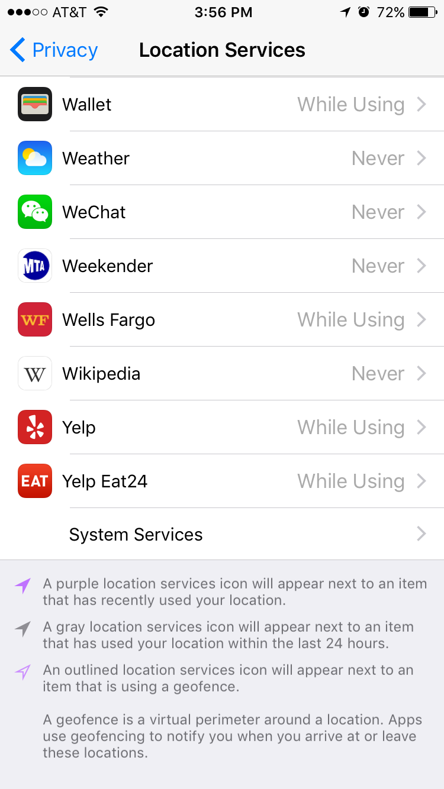
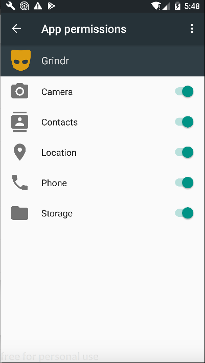

# Mobile app security settings

## Overview
This is the first short training module in a series of three trainings dedicated to securing your mobile device. In this module, participants will learn how to review the security settings on their mobile devices (for iPhone and Android users). In later trainings, they will learn how to encrypt their device, set a secure locking mechanism, and install an encrypted messaging system (Signal). These three modules are meant to be short and simple. Each can serve as a quick win in a larger session about something else, or can stand alone as a short session. Or the three mobile sessions can combine nicely into a 60- to 75-minute block of training around securing a mobile device.

## About this lesson plan

**Review date:** June 5, 2017  
**Lesson duration:** 20-30 minutes
**Level:** Introductory.
This session is for journalists who may not realize how many permissions they have given to the third-party apps on their phone, and for those who are not regularly doing good security hygiene on their devices.

### What will participants learn?

A better understanding of how mobile apps utilize a phones sensors and components, including location services, microphones, cameras, and call history, as well as insight into how those components may be exploited.

### What materials will participants need?

Everyone should bring their smartphone (iOS or Android).

### How should participants prepare?

Most should have read at least a few articles from [#links](Links in the News),  so that they can come in with some context.

### What materials will the instructor need?

A white board, chalkboard or big sticky pads will help, but you can certainly make do without.

### How should the instructor prepare?

Rview the materials, and review the [resources on how to be a better trainer](docs/Chapter01-01-BeingABetterTrainer.md).

## Lesson Plan

### Icebreaker

This can be a quick session and an opportunity to "get something done" that helps everyone take a basic step towards better security.

Have participants to name as many data collection points on their smartphones as they can (think: gyroscope, compass, microphone, camera, GPS, barometer, etc). Note which could be used for malicious purposes. Use a white board or giant sticky note if you have one. Review some recent news stories about consumer applications that abuse access.

### 5-minute discussion

Any mobile device has a few unique identifiers, the International Mobile Equipment Identification or IMEI distinguishes the actual device, while the SIM serial number is unique to each SIM card. These unique identifiers can be used by marketing companies to track a specific device or subscriber through multiple apps.

Android devices allow apps to request access to "Device ID and Call Information." IOS does not allow apps to ask for the device ID, though it is still possible to fingerprint devices using other identifying information.

### Walk through

Ask participants to break into pairs (try to group them by OS), so they can help each other troubleshoot. Each pair will open the settings on their phones together and review the applications that have access to their location, microphone, and camera. (Some participants may feel more comfortable doing this solo, which is fine.)

While the group is reviewing their privacy settings, it's a good time to talk about why an application might ask for access to the camera, microphone or location services.

**For iPhone users:**

Open settings, go to **Privacy** (a small gray icon with a hand)

* Location Services: these applications have access to your location based on GPS, Bluetooth, wifi hotspots and cell tower locations.

    * Apps will either have two or three options for this setting: Never, While Using the App, or Always. If "Always" is an option, it means that the application can have access to your location even if you do not have the application open.
    * The app will often have a one-line explanation as to why it is asking for your location. (E.g.: Yelp says, "This app needs your location to search for nearby businesses.")
    * A small arrow-shaped icon is used to indicate whether an application has used your location recently or within the past 24 hours.

* Microphone: Any application that has requested access to the microphone should appear in a list with a set of toggles (the only settings are "on" and "off")

* Camera:  Any application that has requested access to the camera will appear in a list with a set of toggles (again, the settings options are "on" and "off"). This includes access to the camera itself, as well as access to the photos stored on your phone.

*Note: Phone settings change all the time. If you're planning on working with a large group, double check that these steps still apply, and consider [submitting an issue](https://github.com/OpenNewsLabs/newsroom-security-curricula/issues) with updated instructions if they don't.*

**For Android users:**

The process of checking application permission settings differs between Android versions.You can check `Settings > System > About Phone` if you want to know, or just get started.

* Marshmallow (6.0) or later: Open `Settings > Apps`. Click the gear icon and open **App Permissions**. A list of permissions will be displayed including features such as Camera, Location, and Microphone, along with their current settings.
* Android versions before 6.0:  Open `Settings > Apps` and select an app - you have to review permissions per app, rather than per-sensor.

## Recommended Reaading

### Links in the news

* [Uber uses rider location data and ride history (BuzzFeed News)](https://www.buzzfeed.com/bensmith/uber-executive-suggests-digging-up-dirt-on-journalists)

* [Macy's uses shopper location data (ABC News)](http://abcnews.go.com/Technology/retailers-tracking-shoppers-locations-real-world/story?id=47825826) 

* [Facebook could be listening all of the time: (Independent)](http://www.independent.co.uk/life-style/gadgets-and-tech/news/facebook-using-people-s-phones-to-listen-in-on-what-they-re-saying-claims-professor-a7057526.html) (So you should probably stop letting FB access your microphone. [QZ](https://qz.com/697923/heres-how-to-stop-facebook-from-listening-to-you-on-your-phone/))

* [Uber is fingerprinting your device, even across factory resets (arstechnica)](https://arstechnica.com/apple/2017/04/tim-cook-once-slapped-uber-on-the-wrist-for-breaking-the-app-store-rules/)

### Other great training resources:

* [Tactical Training Collective: Data Privacy](https://gitlab.com/ttc/data-privacy-training/blob/4f9a1657770ff0ad8ae27f3c6aaf4196325a692a/content/Workshops/MobilePhoneSettingsHandsOn.md "Tactical Training Collective: Data Privacy")
