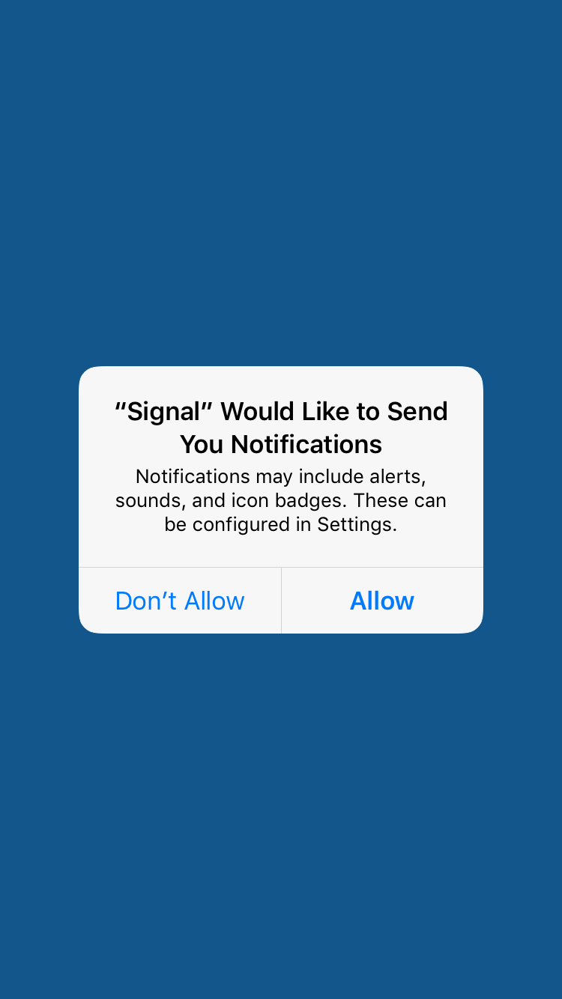

# Setting Up Signal

## Overview
Signal is a secure messaging platform that utilizes end-to-end encryption. Participants should have already been through a [mobile application settings review](LINK TK) and added secure lock screens, to ensure that their device is now ready to use with a program like Signal.

Benefits of Signal include the fact that they do not store your messages on their servers, participants can set their conversations to "self-destruct" and users can customize what information (contact name,
message preview) is available on their phones lock screen.

This lesson plan is intended to be taught as the third in a series, following [mobile app security settings](/docs/Chapter02-01-Mobile-Security-Settings/) and [locking down mobile devices](LINK TK).

## About This Lesson Plan

**Review date:** June 6, 2017  
**Lesson duration:** 15-30 minutes  
**Level:** Beginner

### Preconditions
This lesson assumes users have already reviewed their [mobile app security settings](/docs/Chapter02-01-Mobile-Security-Settings/), and walked through  [locking down mobile devices](LINK TK).

### What will participants learn?

Participants will learn why encrypting messaging is important and easy to set up. They will install Signal, learn how to set and review their privacy settings, learn how to verify safety numbers, set up a group chat, and share a photo.

### What materials will participants need?

Smartphone: iPhone or Android

### How can the trainer prepare?

Two excellent resources on how and why journalists are moving to Signal:
+ [Martin Shelton on Signal for Beginners](https://medium.com/@mshelton/signal-for-beginners-c6b44f76a1f0) 
+ [Security Tips Every Signal User Should Know (The Intercept)](https://theintercept.com/2016/07/02/security-tips-every-signal-user-should-know/).
This lesson draws from both.

 Review the Verification process for [Android](https://ssd.eff.org/en/module/how-use-signal-android)  and [iOS](https://ssd.eff.org/en/module/how-use-signal-iOS).

Additional readings that will help prepare the trainer for questions that come up:
    [Martin Shelton](https://medium.com/@mshelton/using-signal-without-giving-your-phone-number-3a575580f652), [Jillian York](https://motherboard.vice.com/en_us/article/9kaxge/how-to-use-signal-without-giving-out-your-phone-number-a-gendered-security-issue), and [Micah Lee](https://theintercept.com/2017/09/28/signal-tutorial-second-phone-number/) all have great walk-throughs on using Signal without giving out your phone number.

## Lesson Plan

Discussion: Why would you want to encrypt calls and text messages? What does it mean to send them in cleartext?

Remind folks that, in addition to keeping their own conversations private, by using encrypted messaging, they can normalize the use of encrypted messaging, which makes it safer for vulnerable people to use encryption without standing out.

Talk a bit about what Signal can protect (messages traveling over the network) and what it can't protect (messages are still stored on your phone, so anyone who is able to unlock your phone has access to them.)

### Installing Signal

The screenshots below reflect the iOS install process.

1. Start by downloading and installing Signal. Visit <https://signal.org> for quick access to the most current download links.

1. You will be prompted to confirm your device and phone number. 

1. Next, Signal/Open Whisper Systems will send you a six-digit verification code. Add it.  

1. Android users: Signal will offer to become your default messaging app. Say yes! You can still use Signal to send cleartext messages to contacts who don't use the app, and you won't miss messages.

1. You'll know that you've set Signal up correctly when you see the Welcome! popup. You can allow the system to access your contacts and send you notifications. *(NOTE: in the newest version of iOS, it is possible to continue without giving access to your contacts)* 

### For Android:

The steps are very much the same.  Signal will offer to become your default messaging app. Say yes! You can still use Signal to send cleartext messages to contacts who don't use the app, and you won't miss messages.

If you do integrate your SMS with Signal messages, you can always long press on the send icon to send cleartext messages to other Signal users (useful when you don't have data but do need to communicate by text.)

### Additional privacy and security settings

iPhone users: click the white settings gear in the upper left corner to access privacy settings for Signal

In the Privacy tab, you can see and change:

- Numbers you've blocked
- Whether or not to show message previews when you switch apps.
- whether or not you want Signal calls to be integrated with iOS calls (shown on lock screen, show caller's name and number, show in the phone's call history)
- whether or not to relay calls through Signal's server to avoid revealing your IP address to the person on the other end (which can reveal your location).
- You can also clear all history logs in Signal (all messages, attachments, call history)

In the Notifications tab, you can select whether or not to show the sender's name and message, just the sender's name, or no name or message in your push notifications.

You can also decide **how long to keep messages** after you've read them.
- Select a name in a conversation, which will bring you to the contact information and conversation settings.
- There you can enable a setting called "Disappearing Messages," which allows messages to disappear after they have been read. You can set the timer to any length from 5 seconds to 1 week.

### ACTIVITY: 10-15 minutes

#### Verifying contacts and sending messages

- Ask participants to pair up with a neighbor and exchange phone numbers.
- They can practice finding a contact on Signal, sending a message, setting it to disappear, and verifying that it was sent securely. (On Android devices, they will see a lock icon and a pair of checkmarks. On iPhones, messages will simply display the word "sent" and "delivered")
- Each participant should practice Veryifying one another's Safety Numbers. The EFF has a nice walk-through of that process for [Android](https://ssd.eff.org/en/module/how-use-signal-android)  and [iOS](https://ssd.eff.org/en/module/how-use-signal-iOS).
- If users are not in the same space, they can check verification numbers using a separate channel, such as a phone call, iMessage, Facebook message, Twitter DMs, etc.

#### Sending documents
- When composing a message, users can click the paperclip icon to attach photos, videos, gifs, and documents to a message. Sending attachments through Signal is secure and encrypted, and does not automatically save a copy to the mobile device.

#### Creating group chats

- Pairs should pair up in groups of four to set up group chat. A mix of OSs helps here but isn't necessary.
- To create a group chat, select the Compose icon, then select the Group icon.
- Name the group chat, then add multiple contacts who are also Signal users.
- Each person in the group will get a notification that you have added them. Android users will immediately see who else is in the group, even before you send the firs message. iPhone users may not.
- Note: you cannot delete a group once you have created it, but any member can leave the group at any point.

### Wrap up

Remind participants that each conversation is only secure as the most insecure member of the conversation. Signal is a tool that has good options to protect both sides, but if a journalist is using Signal with a source who doesn't have a secure passcode or has left message previews exposed on their lock screen, the conversation may still be exposed.

Similarly, the journalist should take as many steps and precautions a possible to protect their sources by encouraging their sources to read guides on using Signal (such as this one, or the ones linked for trainers above).

## Recommended Reading

+ [How To Keep Your Chats Truly Private With Signal](https://theintercept.com/2017/05/01/cybersecurity-for-the-people-how-to-keep-your-chats-truly-private-with-signal/)
+ [Martin Shelton on Signal for Beginners](https://medium.com/@mshelton/signal-for-beginners-c6b44f76a1f0) 
+ [Security Tips Every Signal User Should Know (The Intercept)](https://theintercept.com/2016/07/02/security-tips-every-signal-user-should-know/)

### More Great Lesson Plans

+ [EFF's Security Education Companion, on How to Install Signal](https://sec.eff.org/topics/how-to-install-signal)
