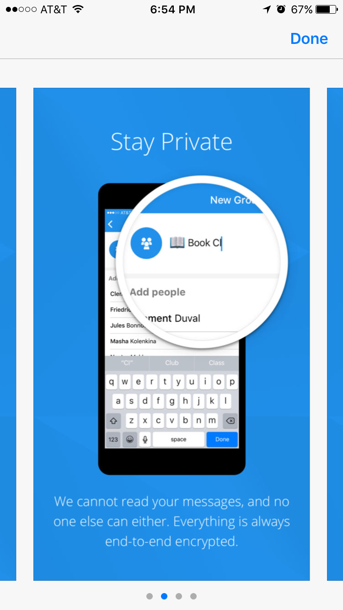

# Setting Up Signal

## Overview
Signal is a secure messaging platform that utilizes end-to-end
encryption. Because participants have already secured their phones in
previous two lessons (mobile application settings review and secure
lockscreens), their device is now ready to use with a program like
Signal.

Benefits of Signal include the fact that they do not store the messages
on their servers, participants can set their conversations to
"self-destruct" and users can customize what information (contact name,
message preview) is available on the lockscreen of the mobile device.

This lesson plan is intended to be taught as the third in a series,
following [Mobile app security settings](Chapter02-01-Checking-Security-Settings/) and **Locking down your mobile
devices** *TK*.

## About This Lesson Plan

**Review date:** June 6, 2017

**Lesson duration:** 15-30 minutes (this lesson is meant to be taught as the
third in a series on securing mobile devices for a total 60-75 minute
training block).

### What will participants learn?

Participants will learn why secure messaging through a program like
Signal is important and easy to set up. They will install Signal, learn
how to set and review their privacy settings, learn how to verify safety
numbers, set up a group chat, and share a photo.

### What materials will participants need?

Smartphone: iPhone or Android

###Level

Beginner

### Preconditions
This lesson is the third in a series, following mobile
applications security settings review, creating a lockscreen, and
setting up device encryption.

### How can the trainer prepare?

Two excellent resources on how and why journalists are moving to Signal
are
[here](https://www.google.com/url?q=https://medium.com/@mshelton/signal-for-beginners-c6b44f76a1f0%23.5nbt1bfp9&sa=D&ust=1507580454388000&usg=AFQjCNETGbYH8ZDLy5BpOFQYLZJRUxRQtQ) and [here](https://www.google.com/url?q=https://theintercept.com/2016/07/02/security-tips-every-signal-user-should-know/&sa=D&ust=1507580454389000&usg=AFQjCNG4rH4p8876Oa3a2sXrDGGJ64P9Xw).
This lesson draws from both.

## Lesson Plan

How to set up Signal -- encrypted messaging and calls 

Click
[here](https://www.google.com/url?q=https://itunes.apple.com/us/app/signal-private-messenger/id874139669?mt%3D8&sa=D&ust=1507580454390000&usg=AFQjCNHE_58WLMXaG6-MQ69F4mL4FHZuPQ)to
download for iPhone and
[here](https://www.google.com/url?q=https://play.google.com/store/apps/details?id%3Dorg.thoughtcrime.securesms%26referrer%3Dutm_source%253DOWS%2526utm_medium%253DWeb%2526utm_campaign%253DMessaging&sa=D&ust=1507580454391000&usg=AFQjCNEV1aNs1tubkexzHIsHqL5WM8kTuQ)for
Android. (the screenshots that follow are for specific to iPhone
installation)

*Note - there has to be a better way to provide download links - these links could go out-of-date or be maliciously edited - KOG*

### For iOS:

Click
[here](https://www.google.com/url?q=https://itunes.apple.com/us/app/signal-private-messenger/id874139669?mt%3D8&sa=D&ust=1507580454392000&usg=AFQjCNHgxYAtVRFWJTp8PwsQdK7zpPvciw) to
download for iPhone

1. You will be prompted to confirm your device and phone number.

2. Next, the system will send you a six-digit verification
code 

3. You'll know that you've set it up correctly with the Welcome! popup.
You can allow the system to access your contacts and send you
notifications. *(NOTE for trainers: in the newest version of iOS, it is
possible to continue without giving access to your contacts)*

### For Android:

[INSTALLATION STEPS TBD ONCE WE HAVE A SPARE DEVICE]

### Additional privacy and security settings

IPhone users: click the white settings gear in the upper left corner to
access privacy settings for Signal

In the Privacy tab, you can see and change:

- who you've blocked
- whether or not to show Signal previews when you switch apps
    (Signal shows up as a blue logo screen, instead of showing a preview
    of what's inside the app)
- whether or not you want Signal calls to be integrated with
    iOS calls (show on lock screen, show caller's name and number, show
    in the phone's call history)
- whether or not to relay calls through Signal's server to
    avoid revealing your IP address to the person on the other end
    (which can reveal your location).
- You can also clear all history logs in Signal (all messages,
    attachments, call history)

In the Notifications tab, you can select whether or not to show the
    sender's name and message, just the sender's name, or no name or
    message in your push notifications.

You can also decide whether or not, and for how long, to keep messages
from a specific person. This setting exists on a conversation by
conversation level.

- Click on the person's name in your conversation, which will bring
    you to the contact information and conversation settings.
- There you can enable a setting called "Disappearing Messages," which
    allows messages to disappear after they have been read. You can set
    the timer to any length from 5 seconds to 1 week.

### ACTIVITY: 10-15 minutes

#### Verifying contacts and sending messages

- Ask participants to pair up with a neighbor and have them exchange
    phone numbers.
- They can practice finding a contact on Signal, sending a message,
    setting it to disappear, and verifying that it was sent securely.
    (On Android devices, they will see a lock icon and a pair of
    checkmarks. On iPhones, messages will simply display the word "sent"
    and "delivered")
- Each participant should practice clicking on their contact's name in
    a conversation, and choosing Verify Safety Number. This allows both
    parties to verify the security of the end-to-end encryption. Each
    conversation between two users has a unique safety number. You can
    verify by checking the series of numbers displayed by each phone
    and/or by each scanning the QR code displayed.

- If users were not in the same space, they could check the
    verification numbers using a separate channel, such as a phone call,
    imessage, Facebook message, Twitter DMs, etc.

#### Sending documents
- When composing a message, users can click the paperclip icon to
    attach photos, videos, gifs, and documents.

- IPhone users can additionally enable access to Dropbox and Google
    Drive
- Android users will see a camera icon in addition to the paperclip
    icon
- Sending attachments through Signal is secure and encrypted, and does
    not automatically save a copy to the mobile device.

#### Creating group chats

- Partner pairs should then pair with a second group to create a group
    chat and continue practicing sending secure messages.

- To create a group chat, click the Compose icon, then select the
    Group icon *(it looks like multiple little people and a plus sign on
    iPhones. It is different for Android)*
- Name the group chat, then add multiple contacts.
- Each person in the group will get a notification that you have added
    them, but they will not know the identities of the other members in
    a group and they will not know what you have named the group.

- Note: you cannot delete a group once you have created it, but each
    member can leave the group at any point.

### WRAP UP and CONCLUSION:

Remind participants that each conversation is only secure as the most
insecure member of the conversation. Signal is a tool that has good
options to protect both sides, but if a journalist is using Signal with
a source who doesn't have a secure passcode or has left the settings to
show contact names in the lock screen, that journalist is still at risk.

Similarly, the journalist should take as many steps and precautions a
possible to protect their sources by encouraging their sources to read
guides on using Signal (such as this one, or the ones linked for
trainers above).

## Recommended reading 

[How To Keep Your Chats Truly Private With Signal](https://theintercept.com/2017/05/01/cybersecurity-for-the-people-how-to-keep-your-chats-truly-private-with-signal/)

