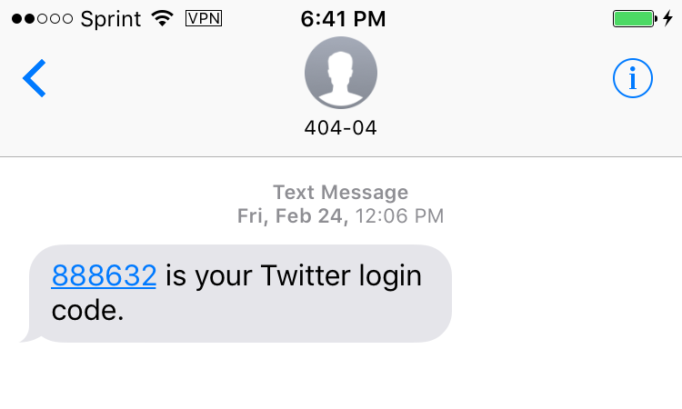
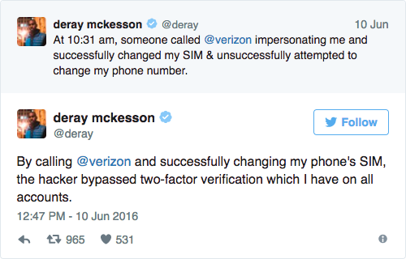
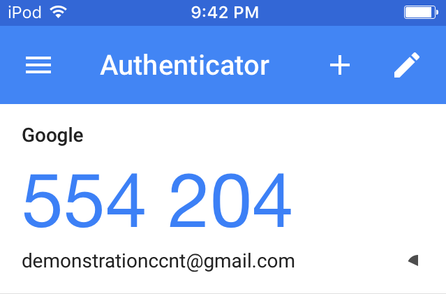
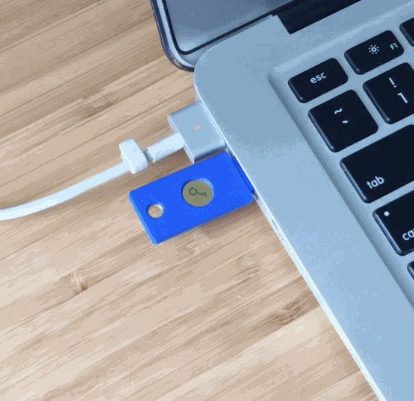
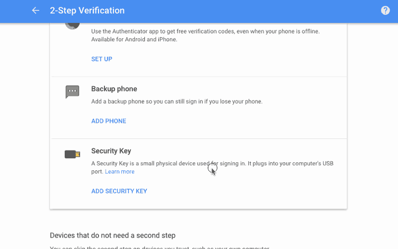

# Two-Factor Authentication

## Overview

Enabling two-factor authentication (2FA) is one of the easiest steps you can take to protect your online accounts. Even if someone gets ahold of your password, 2FA will ensure that they can't get very far. 2FA adds extra protection by requiring additional information when you log in, provided by either a text message to your phone, a code from an authenticator app, or the use of a hardware security key.

This lesson plan will introduce key concepts about 2FA, and guide you through the process of setting up app-based 2FA for your primary email account.

## About This Lesson Plan

**Review date:** Dec 2017 
**Lesson duration:** 30 mins (estimated) 
**Level:** Introductory. 

**Gotcha:** Make sure participants have a reliable strategy for keeping backup codes, so they don't get wholly locked out of their accounts.

**What will participants learn?**
Participants will set up an authenticator app and 2FA on at least a few services and will learn how to use it.

**What materials will participants need?**
They’ll need their mobile devices (iPhone or Android) and laptop computers.

**How should participants prepare?**
Have participants read [Two-Factor Authentication for
Beginners](https://freedom.press/training/2fa-beginners/).

If folks will be sharing unreliable wifi (eg. if you're at a conference center or hotel) encourage folks to install your preferred authenticator app in advance of the workshop. Make sure to include install links for iOS and Android versions in your pre-workshop communications. 

**What materials will the instructor need?**

EFF's [Two Factor Authentication Handout](https://sec.eff.org/materials/two-factor-authentication-handout-for-learners) is a great resource to provide to participants.

**How should the instructor prepare?**

- Read through the lesson plan.
- Set up an email account to use to demo 2FA—a secondary or dummy gmail account is a good option for this.
- Read the two recommended participant readings.
- If you're unfamiliar with concepts in the lesson plan, the recommended readings at the end of this lesson are an excellent way to build your own knowledge store. You should also review the [phishing](https://github.com/OpenNewsLabs/field-guide-security-training-newsroom/blob/master/docs/Chapter02-08-Phishing.md) lesson and recommended readings—they'll help you articulate the importance of 2FA.
- If you're working with a larger organization, check with their IT team to find out if their organizational email supports 2FA. It may not be supported—or they may require and enforce it already. Either way, you'll want to tailor your conversation to their circumstances.
- If possible, check with participants to find out their primary email provider (Gmail, Hotmail, corporate, etc.). The lesson plan covers setting up 2FA for Gmail—you may need to review instructions for other providers beforehand based on the needs of your participants.

**Followup Opportunities**

When you follow up after the workshop, remind folks to confirm that the spot they stowed their backup codes still makes sense, and remind them to follow through on enabling 2FA on any services they didn't get to in the workshop.

[2fa.directory](2fa.directory) is a great resource to share as well.

## Lesson Plan

<!-- make sure acct recovery doesn't get lost-->

### Discussion

If someone gains access to your primary email account, they can easily use that access to reset passwords and take over your other accounts. Two-factor authentication (2FA), along with [strong passwords](Chapter02-06-Passwords.html) and alertness to [phishing](Chapter02-08-Phishing.html), will go a long way towards protecting your online accounts. So have everyone start by identifying their primary email account and setting up 2FA there. Single Sign-On (SSO) accounts, used for logging into multiple services, are also a high priority. Common examples of accounts used for SSO include Google, Facebook, Twitter, and Github. If someone is able to take over your Facebook account, that may give them a back door to all kinds of other accounts and services.

Note: it's easy to get lost in a "is this really going to happen to me?" spiral, or a "sure, but what's the worst that could happen" discussion. Some clarity about what is at stake is certainly valuable but it probably isn't useful to get to caught up in horror stories. Remind folks that 2FA is relatively straightforward once it is part of your workflow. You can either get in the habit of carrying your keys and locking the door behind you, or you can stop and think everytime you leave the house "Have I left anything valuable out? What are the odds that someone will break in today?" [Mat Honan](https://www.wired.com/2012/08/apple-amazon-mat-honan-hacking/) lost a lot of personal archives because some hackers wanted his Twitter handle. For a while hackers were doing a good job of taking over email accounts to send out desperate pleas for money—"Help, I'm traveling and I was hit by a car and I can't reach my parents, but I desperately need you to wire $400 to this random stranger so I can pay my hospital bill and come home."—even though the apparent sender was safe at home. If you work in a newsroom with someone working on sensitive investigations, if anyone who trusts you is doing sensitive work, you owe it to them to ensure that you're not the vector for an attack.

There's very good reason to believe that the Clinton email hack was made possible because [John Podesta didn't have 2FA turned on](http://fortune.com/2016/10/29/clinton-email-phishing-attack/). Don't be John Podesta. He fell for a spearphishing scam that told him he needed to change his password. With 2FA enabled, just knowing his new password wouldn't be enough to give a hacker access to his emails.

It's also possible for passwords to be exposed in error, rather than maliciously. In May 2018, [Twitter asked all of its 336 million users to change their passwords](https://www.wired.com/story/change-your-twitter-password-right-now/), after discovering that they had been written in plaintext to an internal log. Without 2FA enabled, users risked their accounts being accessed by anyone with access to the log. With 2FA, they had an extra level of protection.

Common services include:

- Email: everyone should have 2FA on their primary email account.
- Online banking: banks usually require 2FA, but if your bank makes it only optional, definitely turn it on.
- Backup and file sharing services (e.g., Dropbox)
- Developer tools (e.g., GitHub, AWS)
- Social media networks (e.g., Facebook, Twitter)

Folks should brainstorm other services that they want to prioritize and start setting them up. [Twofactorauth.org](https://twofactorauth.org/) is a useful roundup of services that do provide 2FA, while [TurnOn2FA.com](https://www.turnon2fa.com/tutorials/) has great instructions for many of those services.

**DO:** Demo adding 2FA to a Google or Github account, by setting it up, walking through the process of printing recovery codes, and then using it. Flag for everyone that setting up 2FA can mean they'll be permanently, irrevocably locked out of their account if they lose access to their 2FA device, so everyone should absolutely store backup codes somewhere safe.

Unless you know everyone is using YubiKeys, have everyone download [Authy](https://authy.com/) or [Google Authenticator](https://support.google.com/accounts/answer/1066447?hl=en) now, while you discuss the tradeoffs of the three most common authentication methods.

**DISCUSS:** There are a few easy, widely supported approaches for adding 2FA to your accounts:

-   SMS text messages
-   Authenticator apps
-   Security keys

**Least Great Option - SMS Text Messages:**
Most services allow you to receive an authentication code via text message. SMS codes are super convenient but also vulnerable.

SMS-based 2FA is better than using a password alone, but relying on telephone infrastructure comes with enough trade-offs that the National Institute of Standards and Technology [does not recommend it](https://techcrunch.com/2016/07/25/nist-declares-the-age-of-sms-based-2-factor-authentication-over/). However, if SMS-based 2FA is your only option, using it is better than not using it. 

For example: by convincing Verizon to redirect Deray McKesson's phone messages to a new SIM card, a hacker was able to bypass 2FA. They were able to access the Black Lives Matter activist's email and Twitter records.

[SMS-based 2FA is better than nothing](https://motherboard.vice.com/en_us/article/youre-probably-fine-with-sms-based-two-factor-authentication), but it isn't the best option.

**Better Option - Authentication Apps:**
Some services allow you to receive your 2FA code from a mobile app. There are many options to choose from, including [Google Authenticator](https://support.google.com/accounts/answer/1066447?hl=en),
[Authy](https://authy.com/), and [Duo Mobile](https://guide.duo.com/).

Some web services let you attach multiple authentication apps to the same account, which can be incredibly helpful when multiple people need access to a single account. Authenticator apps are also great because they work even when you don’t have access to your phone network.

Unlike SMS messages, authenticator apps aren't vulnerable to attacks against your mobile network.

**Even Better Option - Security Keys:**
A security key is a physical device, usually connected via USB, that you can use to authenticate your account.

They’re reasonably cheap — one of the most popular options, a [YubiKey](https://www.yubico.com/) costs
[~$25.00](https://www.yubico.com/store/).

Using them is easy—you simply insert your security key during login, and physically tap it when prompted.

Security keys are [highly resistant](https://security.googleblog.com/2019/05/new-research-how-effective-is-basic.html) to phishing attacks, making them one of the best options available. Unlike a code-based 2FA method, phishing sites don’t have a great way to intercept information from security keys. Security keys generate and store a unique ID for each login on first registration, and check this ID on subsequent logins. If you were to land on a phishing site with an illegitimate URL domain (e.g., faceboook.com instead of facebook.com), the ID will not match and the key will not cooperate with the website.

Security keys are not yet as widely supported as authenticator apps, but the standard is getting traction on large websites. 
Google, Facebook, and Dropbox all support security keys. If you’re using Gmail as your email provider, or if you're using any other Google services, security keys are a great option. Most major browsers also now support security keys.

### Pick One

Encourage your audience to use whichever 2FA method is available and practical. SMS is absolutely better than going without, but you should strongly nudge participants toward hardened options, such as authenticator apps or security keys. In most cases participants will need to download an authenticator app.

You should have already demonstrated setting up 2FA, but if you didn't, do that now.

Everyone should have downloaded Authy or Google Authenticator by now, but if they haven't, have them do that. Seriously though: it is far preferable to do this during the discussion so you don't overload your bandwidth.

And then have everyone set it up on their primary email account. Have folks look through [2fa.directory](https://2fa.directory) if it isn't obvious how to setup 2FA on their primary email account.

Make sure everyone also sets aside backup codes!

Setting up 2FA should take no more than 10 minutes.

Time to break out the laptops. The instructions below apply to Gmail. If any participants use a different primary email provider, you may need to modify the lesson plan accordingly.

Show everyone how to navigate to the Gmail setup page. Account icon (top right) > `Manage your Google Account` > `Security` > `Signing in to Google` > `2-Step Verification` > `Get started`

**Set up SMS authentication:**
First, participants will need to enter their password to verify that they own the account.

Next, participants will have to add a phone number. (Exasperatingly, you can't set up app based authentication without first setting up SMS authentication. At least not on Gmail.)

Once participants have followed the steps on screen to register their phones, they will be able to receive 2FA codes through SMS text messages.

**Set up an authenticator app:**
As discussed, we want more security than SMS provides. So once you have enabled SMS based 2FA, have everyone set up app based authentication. They'll have to select "Authenticator App" and then open the authenticator app (probably on their phones) and add an account. They should be looking at a QR code on the screen and a camera on their app.

**Backup Codes:**
Now that everybody has 2FA set up, they DEFINITELY need to download backup codes and put them someplace safe. Each backup code can only be used once, but if you lose your phone (or just leave it home one day) and all your authentication is connected to your phone, you're going to be awfully frustrated without backup codes.

**Disable SMS authentication:**
After setting up an authenticator app or security keys, participants should remove their phone as a 2FA method.

**Security Keys (optional):**
If particpants have YubiKeys and want to set them up, they should scroll down to `Security keys` and click `Add security key`. When prompted, they should insert the key into the USB port, and physically tap the gold disk on top.

They'll be prompted to name the newly-registered device. During login, instead of typing in a 2FA code, anyone who sets this up can just insert and tap the key.

Note: Some new computers (e.g., Macbooks released since 2016) only have USB Type-C ports. If you can’t use a traditional USB 2.0 or 3.0 port, you can still use security keys with a USB Type-C adapter. Here’s a short list of [Type-C adapters that are confirmed to work](https://www.yubico.com/support/knowledge-base/categories/articles/how-do-i-use-a-yubikey-with-usb-c-adapters/). Alternatively, you can purchase a [USB Type-C
YubiKey](https://www.yubico.com/store/).

## Recommended Reading

+ EFF's Security Education Companion has a great [Two Factor Authentication](https://sec.eff.org/topics/two-factor-authentication) lesson.
+ [Two-Factor Authentication for
Newsrooms](https://source.opennews.org/articles/two-factor-authentication-newsrooms/)
+ [London Calling: Two-Factor Authentication Phishing From Iran](https://citizenlab.org/2015/08/iran_two_factor_phishing/) from Citizen Lab (Munk School of Global Affairs, University of Toronto) is a good roundup of ways that really good phishing can circumvent 2FA. (August 2015)
+ [Phishers rip into two-factor authentication](https://www.theregister.co.uk/2017/05/03/hackers_fire_up_ss7_flaw/), *The Register* also covers some ways that phishing can be used to circumvent 2FA. (July 2006)
+ [Text scams: The messages that allow criminals to break into your iPhone, and how to spot them](https://www.independent.co.uk/life-style/gadgets-and-tech/features/text-scams-icloud-iphone-google-android-messages-sms-security-privacy-cybercrime-a7067411.html), *The Independent*, details another SMS-based phishing attack (June 2016)
+ [Evolving Phishing Attacks Targeting Journalists and Human Rights Defenders from the Middle-East and North Africa](https://www.amnesty.org/en/latest/research/2019/08/evolving-phishing-attacks-targeting-journalists-and-human-rights-defenders-from-the-middle-east-and-north-africa/), by Amnesty International (2019)
