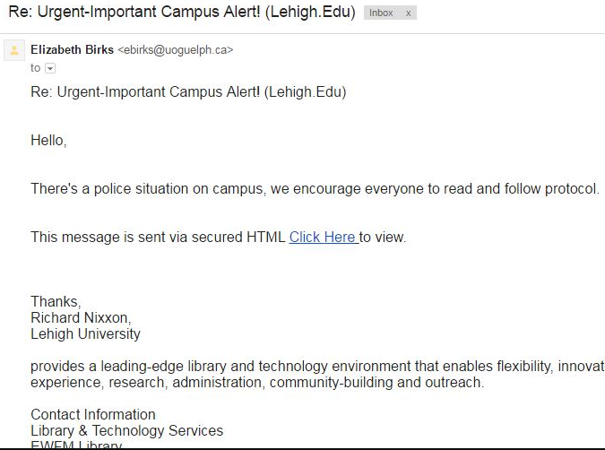
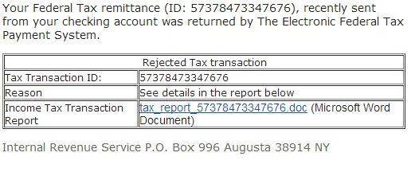

# Phishing Basics

## Overview

*Phishing* is an email-based social engineering tactic that uses misplaced trust to extract information and access. Like other forms of social engineering, its purpose is to trick you (the target) into divulging information that can be used to access to  private data, networks or resources. Phishing is often  *Spear-phishing* is a form of phishing targeted at a particular individual or group. This sort of attack is widespread, common, and responsible for many [notorious examples](https://en.wikipedia.org/wiki/Podesta_emails) of data loss or leakage.

Defending against phishing begins with *awareness* of particular risks and some basic safety *techniques* and can be aided by the use of certain *tools*.

Participants will consider phishing in the context of *trust decisions* and develop awareness and techniques to make these decisions when interacting on the web. Participants will learn the basic mechanics of phishing and spear-phishing, the techniques attackers may use, how to approach online trust decisions, and important, basic techniques and tools.

## About This Lesson Plan

**Review date:** June 2017  
**Lesson duration:** 45 minutes  
**Level:** Introductory  

**What materials will participants need?**  
Access to the internet.

**How should participants prepare?**  
Read the introductory articles in the intro email.

**What materials will the instructor need?**  
Presentation software, sticky notes, pens. (Optional: a pair of index cards per participant, numbered 1 and 2.)

**How should the instructor prepare?**  
Use outline below to prepare presentation, send intro email.

## Lesson Plan

### (Optional) Part A: A Trust Game

Each participant is given two cards, numbered 1 and 2. On each card, participants should write down a statement about themselves, one true and one false. The statements should not be things other participants already know and should not be immediately verifiable ("I have brown hair" is immediately verifiable; "When I was 12 my hair was purple" is not, unless the group has a very long history together.) The false statement shouldn't be implausible.

-   Post each participant’s sticky-notes a visible place under their name.
-   When everyone is done writing down cards, begin the *interrogation* phase. For each participant:
    -   The facilitator reads both cards
    -   The facilitator starts a 1-minute timer. During the one-minute session, group members ask the participant **yes or no** questions about the facts represented on the cards.
    -   At the one minute mark, facilitator asks each member of the group to record which card #1 or #2 they think is true.
-   *Debrief*: when each participant has been interrogated, the facilitator conducts a debrief. For each participant, the group indicates (by show of hands) which card #1 or #2 they thought contained the true statement.
-   *Reflection*: The facilitator may ask the group to reflect how the information obtained during the interrogation affected how they voted:
    -   What sorts of questions were useful in making a true/false determination?
    -   What kind of context aided in the decision?
    -   What kinds of questions were the most revealing?

### Part B: Awareness

Social engineering always involves the manipulation of trust, aided by deception. As the trust game illustrates, we are frequently required to make trust decisions with limited context and limited time. Attackers know this, and take advantage.

**The social engineering continuum**:

- **In-person** impersonation fraud (door-to-door sales people misrepresenting themselves, fraudulent personal identification)  
- **Telephone** impersonation fraud: (calling a help-desk phone number to request unauthorized account details or a password reset)
- **Phishing:** impersonation fraud using email

A definition of phishing: an email-based social-engineering attack that uses deception to extract information and access.

**Basic components of a phishing attack:**

-   **An email**: the deception begins with an email (or sometimes another message such as an sms message) containing a call to action. The email will very frequently be disguised so that it appears to be from a legitimate source, with which the subject already has a relationship.

-   **A call to action:** the email will always contain a call to action. Typically this is in the form of a link to click on to complete a task or view a document. The call to action is typically designed to appear both urgent and legitimate, and possibly enticing in some way.

-   **A harvesting interaction:** clicking on the call to action/link contained in the email will open an interaction—usually but not always a login screen. Like the email, this is generally disguised to appear legitimate, and may attempt to extend the sense of urgency and legitimacy.

**Example: an urgent alert!**

-   Urgent subject matter designed to distract from a trust decision. Use of emergency or urgent language is frequent in phishing attacks because it is emotionally distracting.

-   Call to action (click here) will require a login, which is the exploit.

**Example: a document from a trusted source**

- This email appears to be from the government (a more-or-less trusted source).

- In order to open the document, some kind of information or authentication is required, which is the exploit. The document itself may also contain malware.

- Taxes or other financial interactions are frequently exploited by phishers because they may be perceived by their targets as urgent. Freely-available personal data may be included, to increase the chance of deceiving the target.

**Example: brand impersonation**

-   What? You didn’t just spend $711 on Amazon? Better click to find out what this is all about … whoops.

-   False transaction reports, when combined with convincing branding, are frequent vectors.

**Spear Phishing**  
The phishing examples so far are cases of general-purpose or mass-market phishing. In contrast, **spear phishing** is a highly targeted variant of phishing that leverages details about the target’s life and social connections to intensify the deception. Emails may contain personal messages that **appear to be from friends or colleagues**, and may even relate to **real events**, issues or other plausible subject matter.

Those who have access to particular information or access that a sophisticated attacker wants are most likely to be spear-phished. Journalists are particularly vulnerable.

***(End Slides/Topics for part B)***

### Part C: Group Sharing

*\[Facilitator can pause to offer a chance for participants to ask questions, and to share examples of phishing attempts they’ve experienced in the past.\]*

### Part D: Presentation: Making trust decisions online

**Trust decisions**. When we disclose information, we are making a **trust decision** about the legitimacy, safety and intentions of the party to which we disclose. Defending against phishing requires the development of one **habit** and a set of **techniques**.

**Habit: Every trust decision should be a conscious one**  
Every time we disclose information online, we grant trust to whoever receives our data; it's better to make these decisions on purpose rather than subconsciously. Developing the mental habit to evaluate the trustworthiness of the recipient of our data is critical to protect against phishing attacks.

** Activities that imply trust:** 

-   Submitting an online form
-   Clicking on an email attachment
-   Replying to an email

**Exercise:**  
 What other activities online imply trust? What would help you to remember to make a conscious trust decision when divulging information online?

**Techniques: Evaluating emails: slowing down, context**  
Urgency is the enemy of careful decision-making. Even (and especially) when confronted by an urgent email, it is important to **slow down**, and take the time to evaluate the legitimacy of the email.

Another reason to slow down is to avoid clicking on anything (links, attachments, etc.) in an untrusted email until a trust decision has been made.

Sanity check: **context**. A first, though not at all sufficient, check on any email is to evaluate whether it is expected or plausible. Is it the result of an activity that we ourselves initiated -- for example a transaction that we initiated or expected? Anything that comes as a surprise or out of the blue should be automatically suspect.

**Techniques: Evaluating emails: implicit factors**  
Answering "yes" to any of the following questions may suggest that the email is not legitimate:

-   The email has an unusual "from" address whose domain is not associated with the organization
-   The email body contains non-standard or odd-looking formatting
-   The email body contains spelling mistakes or unusual grammar
-   The formatting of the email differs from other email received from the same organization
-   The email contains threatening, overly-urgent or very enthusiastic language

While any of these factors suggest illegitimacy, **their absence does not guarantee trustworthiness.

**Techniques: checking the "from" domain**  
A strong indicator of a phishing email is an unexpected domain in the email’s **from** header.

In the above example, the bank has sent an email from an unexpected domain. This is highly suggestive of phishing. Note that you must check the *domain*, and not the display name when checking this.

*Note*: [*from domains are easy to spoof*](https://en.wikipedia.org/wiki/Email_spoofing), and therefore a correct-looking address here doesn’t prove that an email is legitimate. However, an obviously bad address in this space strongly suggests that an email is probably illegitimate.

**Techniques: checking the domain of any links or downloads**  
The closest thing to a conclusive test for a phishing email is to examine the **domain** of any link it contains. This will likely require checking the HTML markup of the email or otherwise determining what domain the email is attempting to link you to.

Some tips:

-   Do not click on untrusted domains
-   Look for tricky domains. Sometimes attackers use special, confusingly-similar domains. The domain may only differ from the legitimate one by a single character.
-   If unsure, consult the WHOIS record of the domain (you can use the free service at <https://whois.icann.org/en> for instance). Legitimate companies will use public WHOIS records to confirm their actual ownership of a domain.

**Group Exercise: phishing quiz**  
Take the phishing quiz at: [*https://www.sonicwall.com/phishing/*](https://www.sonicwall.com/phishing/) and discuss the results.

**Techniques: after the click-through: context check**  
After deciding to click on a link in an email, we have the opportunity to evaluate context again. Questions to ask:

-   Was the result of the click what I expected?
-   Did the click take me result in an unexpected redirect? Ie: The link appeared to be sending me to domain X but I suddenly find I’m on domain Y.
-   Does the state of the page (logged in or not) appear correct? For example, if I’m already logged in to Google in my browser, is the page I’m on asking me to authenticate again?
-   Does the link I clicked on ask for any sensitive information? If so, can I verify the request in some way other than email?

**Techniques: after the click-through, check the domain again**  
Now that we’re on the destination page, we may be confronted by an additional call to action. It’s time to make a second trust decision. Before submitting information, evaluate the domain of the page again according to the same criteria used to evaluate it in the email.

**Summary: flow of trust**  
*\[Instructor can use examples from section B, as well as examples mentioned by participants, to work through the flow diagram below:\]*

### Recommended reading

**Links in the news:**

- <https://twitter.com/ericgeller/status/944205900138430464>

- <https://gizmodo.com/heres-how-easy-it-is-to-get-trump-officials-to-click-on-1794963635>

- <https://www.buzzfeed.com/sheerafrenkel/russian-hackers-faked-gmail-password-form-to-invade-dnc-emai>

- <https://en.wikipedia.org/wiki/Podesta_emails and https://en.wikipedia.org/wiki/2016_Democratic_National_Committee_email_leak>

- <https://www.welivesecurity.com/2016/04/23/sms-phishing-attackers-continue-pursue-apple-users/>

**Other resources:**

 - <https://freedom.press/training/email-security-tips/> - Freedom Of The Press Foundation's phishing training.
