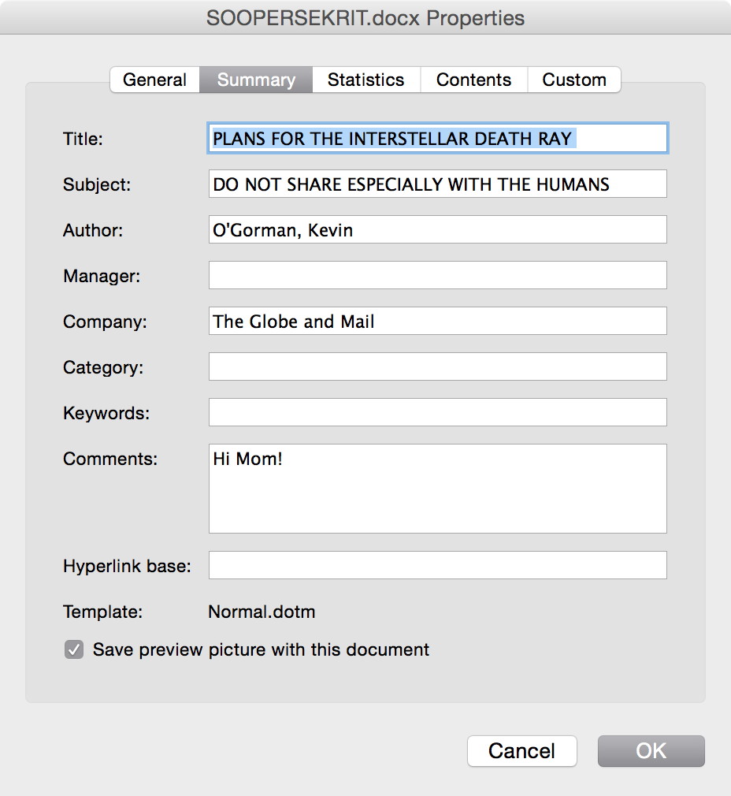

Scrubbing Metadata from Files- A low-fi approach
================================================
**Tools To Scrub Metadata**

If you're planning to publish a document that you got from a source, [don't burn your source](https://source.opennews.org/articles/how-protect-your-sources-when-releasing-sensitive-/) in the process. At a minimum, ensure that you're not

It’s straight forward analyze images for appended metadata, and a growing number of web-based tools make this process painless. <http://exifdata.com/> is one.

+ It’s fairly easy to scrub unnecessary metadata on [Windows](http://www.digitalcitizen.life/what-file-s-metadata-and-how-edit-it).

+ Users with some Bash comfort should consider the [Metadata Anonymisation Toolkit](https://mat.boum.org/).

To learn more, [please read our section for lessons on scrubbing metadata](https://docs.google.com/document/d/1MS9MoeXmXw_TYOmjXto9mvg-EROL5vds2sl5zytQTZk/edit#)

## Overview 
Files such as Word documents and JPEG images usually
contain information about the systems used to create them. This
information, commonly referred to as metadata, could inadvertently
reveal personally identifiable details about your sources to anyone
given access to the files. Removing metadata from files
provided by sources before sharing or publishing them is critical for anonymous source protection.
This lesson plan covers what you'll need to know to find file metadata in Word documents and JPG files, and how you can share or publish content from these files without exposing metadata.

##About This Lesson Plan

**Review date:** June 5 2017  
**Lesson duration:** 45 minutes  
**What will participants learn?**  
Basic understanding of what metadata is and basic techniques to "clean"
common file formats before publishing or sharing. This session does
\*not\* cover myriad other types of metadata, most notably the metadata
created by journalists and sources when they browse the web, use their
mobile phones, or communicate using VoIP, chat, email, etc.

**What materials will participants need?**  
Email access, a laptop with MS Word installed, access to printer and scanner 

**What materials will the instructor need?**  
Sample document (like a PDF or Word document), sample image (.jpg or
similar format) both with identifying metadata included -- such as the
name of the Microsoft license-holder, geotag/location data, etc.

**How should the instructor prepare?**   
Review Lesson plan, and share example documents from ScrubbingMetadata folder with participants.

##Lesson Plan

### Icebreakers/discussion 
Did you know that sharing and publishing files can burn your sources?

Example: Vice and John McAfee:
[*https://www.vice.com/en\_us/article/john-mcafee-bath-salts-belize-murder-fugitive-gregory-faull*](https://www.vice.com/en_us/article/john-mcafee-bath-salts-belize-murder-fugitive-gregory-faull)

When Vice published the story, the photos still had location data
included and basically burned their source.

Example: [*How The Intercept Outed Reality
Winner*](http://blog.erratasec.com/2017/06/how-intercept-outed-reality-winner.html)
- Reality Winner used traditional mail, not the Internet, to share
documents with the Intercept, but was caught due to both operational
security mistakes and metadata included in the printed files she shared.

*\[Discussion point: Instructor should ask participants how and when they share documents that they optained from a source, and what the potential risks are in doing so. Then, if they didn't come up, the instructor should cover the 3 points below. \]*

**Sharing outside the newsroom**  
When you share or publish information obtained from a source, a good rule of thumb is to only share the minimum amount of information
necessary to tell a story - in the most extreme case, for example,
simply cutting and pasting document text into a plaintext file
effectively removes all digital metadata. There may be cases where this isn't feasible, for example, when you're sharing a document with a third party to verify its authenticity. Even then, simply sharing the original document may expose your source, so it's important to remove any file metadata that you can.

**Sharing within the newsroom**  
Even for documents not shared outside the newsroom, removing metadata
before sharing with colleagues reduces the risk of an accidental or
malicious leak of source information.

**Publishing documents with a story**  
Redaction of information within documents may be necessary before
distribution, and it’s important that this be done irreversibly. Some
document formats include revision histories, others may still contain
text that has been graphically obscured. Metadata scrubbing techniques
work well here too. More sophisticated methods of watermarking
documents, such as graphical watermarks or typographical variations may
also require a reconstruction of the document be made for publication,
as the risk of publishing even the redacted original would be too great.

**Removing Metadata**  
Metadata-removal software exists, but a simpler 
approach is to print out a sensitive document, scan it back into your
computer and rename the file. Similarly, you can remove metadata from an
image or photograph by screenshotting the original and sharing the copy
only. (Note that color printers may add nearly-invisible metadata to
printed pages as an anti-counterfeiting measure - printing documents in
black and white reduces the chance of exposure.)

(Additional bonus! Being aware of what kind of metadata exists --and how
to find it-- also gives you a leg up as a reporter when researching and
developing evidence and leads for stories.)

### Active Lesson: Removing metadata from a Word doc and a JPEG image.
*\[Trainer should begin by introducing participants to the concept of
document metadata by showing examples of Word documents
and images, showing where to find the metadata and what types of
information may be "hidden" in a document’s guts.\]*

**Finding Microsoft Word metadata**  
The easiest way to view a Word document's metadata is to open it in Word and open the Properties dialog:

* In MS Word for OS X, choose **File > Properties** and select the summary tab.

* In MS Word 2010 and later for Windows, select the **File** tab, click **Info**, and select **Properties > Advanced Properties** on the right-hand side of the pane.

*\[The instructor should take a moment to review the information included under each tab in the Properties dialog box with participants\]*

**Finding image metadata (EXIF data)**
Most digital cameras, including smartphone cameras, add metadata to photographs, typically including information about camera settings and the time and location of the shot. You can find this metadata by opening the image information in an image viewing application. For example, in OS X, you can use the built-in Preview App, by 

**Scenario: scrubbing metadata**  
How do you share SOOPERSEKRIT.docx with a 3rd party
without exposing the information in the document properties? How do you
share MADSCIENTISTLAIR.jpg without giving away the GPS coordinates
embedded in the image EXIF data?

5-10 minute small group discussion: ask participants to brainstorm ideas
of ways they could share or publish the sensitive information. Have each
small group report back and see if anyone came up with the idea to
retype a document, print and scan, or utilize screenshots. (Spend some
time talking about other solutions that come up.)

10 minute activity: Trainer should send an image file that has location
data and a Word document with ownership or similar information stored.
Have participants partner together, one pretending to be the journalist
with the sensitive information, the other pretending to be a third-party
expert in the subject area who is going to review the sensitive
documents. In the second half of the exercise, one person should be a
sensitive source with a photo to leak and the other should be a
journalist who is going to receive a "scrubbed" image.

-   The "journalist" should print out the document and use a scanner or
    > mobile application to ingest the document and share. (If the
    > "journalist" uses a color printer, the trainer should verify that
    > they printed the document in monochrome.)

-   The "source" should make a screenshot of the original file and send
    > the scrubbed version to the "journalist."

## Recommended Reading

* [*Protecting Your Sources When Releasing Sensitive
Documents*](https://source.opennews.org/articles/how-protect-your-sources-when-releasing-sensitive-/)
- a checklist for handling and releasing leaked documents
