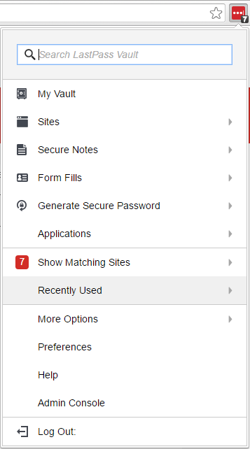
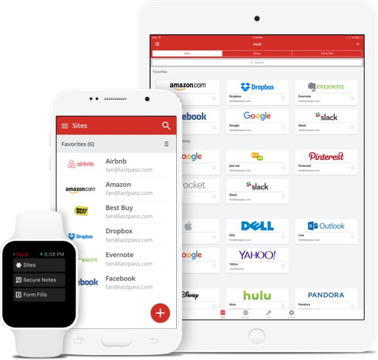

# Security in the Newsroom: Who are you?

This is a living document and the most recent version can be found at: <https://goo.gl/7ojKpw>. This lesson plan, which covers Passwords and Two Factor Authentication is a great hour long brown-bag session that was shared with us by Alan Palazzolo at the Minneapolis Star Tribune. For other great overview lesson plans, take a look at:

[NICAR18: Digital Security Tip Sheet for Journalists](https://docs.google.com/document/d/1q3gBvOEviV_0XMpMjvBiHSaKcl64uu4NwOoEVfXyYqU/edit#), March 2018 by @mshelton, @geminiimatt, @mtigas, Sequoia McDowell and @camfassett. 

Or, there are more great resources in [the resource roundup](Capter03-02-Resources.html).

## Logging in and authentication

There’s a login for everything these days. The default way to prove to computers that you are you is with a username and password. We all have hundreds of different websites, computers, and other digital things that require passwords. That’s a lot of opportunity for attackers to try to steal your identity or your personal information. So, how can we make sure we are being safe when we log into things? Let’s talk about strong passwords, password managers, two-factor authentication, digital keys, HTTPS and more.

## Security

A quick step back. Security comes in many forms, not just digital. There are lots of aspects to consider when it comes to your personal security, and many things to focus in on when talking about security in the newsroom. A few things to keep in mind about security in general:

-   It’s unfortunate, but more often than not, good security takes a bit of effort. And in practice, there is often a trade-off of what is easy and what is most secure.
-   Good security does not rely on trust, though in practice it requires some.
-   Though there are good general security practices, thinking about your security in terms of threat modeling (who will reasonably attack me, and what specifically do you need to defend against) will help focus your efforts.
-   Attacks are always changing, it’s good to stay up to date if just on a high level.
-   Talk to experts. Unless you are totally confident of what you are doing, take a moment to double check with someone how to practice good security.
-   You are never 100% secure. Understand what you are risking.
-   Even if you don’t think you are at risk, we are all avenues to other people who may be targets. [*You are worthy of a data breach*](https://medium.com/@mshelton/journalists-you-are-worthy-of-a-data-breach-55f8e53fd3fe).

## Some terminology

Just to make sure we are all on the same page, here are some top-level words and concepts:

-   **Authentication**: A mechanism used to identify someone. The most common mechanism is a username and password, but there are others, such as PIN codes, fingerprints, and more.
-   **Authorization**: The ability to access a particular resource. For instance, your user on your computer has access to edit certain files, but not core, system files.
-   **Password**: Usually a single word or short random set of characters used for authentication.
-   **Passphrase**: A phrase used for authentication, usually at least a few words or a whole sentence. Note, that when we refer to good, secure “passwords”, we usually mean a passphrase.

 -- this icon indicates that you should customize the section to your newsroom.

 -- If you see this icon, this is important.

## What’s at stake?

Though fairly simple, authentication, i.e. logging in, is a huge, far-reaching topic. Almost anything important these days has some sort of authentication. Your email, you bank account, your bills, your medical history, and so much more all are just a username and password away from being accessed.

**One compromise can lead to many**. Huge companies such as Target, Equifax, Yahoo, and [*many others*](https://haveibeenpwned.com/PwnedWebsites) have had huge amounts of their user’s data compromised. If you have use the same password or a pattern of passwords, once one site if compromised, your other accounts are much more likely to get compromised.

It is very possible that you have had an account compromised. The site “[*Have I Been Pwned*](https://haveibeenpwned.com/)” will give you some insight into that possibility. Note that “pwned” is a term used to describe getting “owned” by someone.

[*Mat Honan had his digital life erased*](https://www.wired.com/2012/08/apple-amazon-mat-honan-hacking/) and hijacked because of a series breaches chained together.

**Your identity**. If someone has access to your account, they can do things as you, such as post things to Twitter, reset accounts, or access sensitive information.

The Twitter account of CNN’s host, Anderson Cooper, was [*compromised*](http://thehill.com/homenews/media/364646-anderson-cooper-says-twitter-account-hacked-after-tweet-calling-trump-a) just as recently as December. Deray Mckesson ([*@deray*](https://www.wired.com/2016/06/deray-twitter-hack-2-factor-isnt-enough/)), a prominent figure in the Black Lives Matter organization and movement, had his account hacked into, even with second-factor authentication enabled. This is a good instance where one thought a security practice was solid, but in reality, it had holes.

**Specifically your email**. Your email is very strongly tied to your identity. In fact, most online accounts allow you to reset authentication with email, so, if your email gets compromised, many other accounts can be compromised. Your email is also often a trusted contact for the inbox of the people you know, so an attacker can more easily become a trusted contact if your email is compromised.

### Passwords

Passwords (and usernames) are probably the most common way to authenticate someone to access a service and one of the most important security concerns.

### Password managers

Most of us have hundreds of services that require a username and password. Most of us can’t remember hundreds of passwords. This is where a password manager comes in; they create a secure way to store all the username and passwords you need. And most have the ability to integrate with your web browser so it makes it easy to login to a service.

 **Installing and using a password manager is possibly the biggest step you can take in making your life more secure, and it’s one of the easiest.**

There are two popular password manager products that you should consider using: LastPass and 1Password. Both have similar features, but **LastPass** has a free tier with all the main features, and it can be used/installed without installing an application on your computer, so it is suggested for most users.

To see other options and features, see this [*Wirecutter review*](https://thewirecutter.com/reviews/best-password-managers/).

It’s important to note that you are putting a lot of trust into your password manager and the company that makes it and stores your data. Though it is not in their interest to compromise anyone’s security, you cannot be 100% sure that it won’t happen, and access to all your passwords is a lot of important information. But, it is still better than most alternatives.

### LastPass

There are many ways to use and access LastPass.

One of the main ways is to use their [*browser extensions*](https://lastpass.com/download.php). These are particularly great because they make it very easy to log into websites.

Another useful way to get access to your LastPass account is with their mobile applications, both for [*Android*](https://play.google.com/store/apps/details?id=com.lastpass.lpandroid&hl=en) and [*iOS*](https://itunes.apple.com/us/app/lastpass-password-manager/id324613447?mt=8).

You can also install [*stand-alone desktop applications*](https://lastpass.com/download.php) for LastPass.

**Does your newsroom have a policy that prevents users from installing software or plugins? How should users in your newsroom install?**

### Unique passwords

So, now that you have a password manager, you can practice some other good security more easily.

 **Use unique passwords for everything.**

Unique passwords are important because you never know what site or service may be compromised. If you share passwords among services, the password is only as strong as the weakest security of all the services.

Unique passwords are hard to do without a password manager. Some people use a specific pattern that makes a unique password for each service, but more than likely, this pattern is easily discerned by an attacker.

Since Strib account passwords must be changed regularly, it’s tempting to have your password include a number that you just increment at each change, e.g. “fiddler111” followed by “fiddler112”. This is easy to remember but leaves a trail of breadcrumbs for any adversary who discovers an old password.

With a password manager, it is trivial to use a unique, unrelated password for every service.

### Strong passwords

The strength of a password refers to the ability for it to be determined or guessed by trying many combinations of words, letters, numbers, and symbols. The password “password” is both very short and extremely common and might be the first attempt someone uses when guessing your password; therefore it is very weak.

 **Use strong passwords.**

In fact, just use long, random passwords. Most password managers will provide a way to generate passwords.

In some cases, you have accounts that you log into often where you need a password that you can remember. Overall, length is more secure than the variation (i.e. using symbols or uppercase letters). So, create a phrase that is memorable, but not easily guessable, and maybe add some easily rememberable variation. Some examples:

    security-sure-is-gr8-for-us-all!

    is it snowing outside today in minneSNOWta?

Note, that once you start using really long passwords, you may notice that some services limit the length of your password. This is bad security on their part but not something that you will be able to change. This can be particularly annoying if you paste in passwords where the input has a maximum length.

### While we’re at it...

Use unique, random usernames too. Many times your username is an email, but when its not, why not use a unique username. This adds more security as it is less guessable, and if compromised less likely to be associated with another account.

###  Shared passwords

It’s a sad fact, but we often use shared passwords in the office; sometimes this is out of necessity and sometimes it’s just a lack of effort.

Until our organization has a common, shared password solution that makes shared passwords easy and secure, here are a few tips for handling shared passwords. Basically, follow the same advice for non-shared passwords.

-   Don’t use easily guessable passwords like `startribune`. Use strong passwords.
-   Don’t use the same password over and over again. Use unique passwords.
-   Don’t write them down, or if you must, dispose of them in a shredder or other secure way.
-   Put your shared passwords in your password manager.

*To explore*: It has been suggested that some services will allow multiple authenticator applications to be tied to one account, thus allowing 2FA for a shared account.

###  More about passwords

There is plenty written about passwords; here are some good resources if
you want to dive deeper.

-   [*Security in a Box’s article on passwords*](https://securityinabox.org/en/guide/passwords/)
-   [*Wirecutter’s review of password managers*](https://thewirecutter.com/reviews/best-password-managers/)
-   [*OpenNews security training on passwords*](Chapter02-06-Passwords..html) 

## Two-factor authentication

A password is often referred to as a knowledge factor when authenticating. To make accounts more secure, more factors can be introduced if the service allows it. Common examples are possession factors (keys, phones, etc) and inherence factors (fingerprints, iris, etc).

Many services these days offer 2FA (two-factor authentication), allowing you to add a factor on top of the main mechanism which is most often a username and password. Some of the common ones are:

-   A text or call sent to your phone with a specific code.
-   A custom or 3rd-party application that provides a code (usually installed on your phone).
-   A USB key
-   A physical device that generates a code.
-   Fingerprint.

Note that two-factor authentication may be referred to in other ways such as “two step verification” or “multi-factor authentication”.

 **Enable two-factor authentication wherever you can.**

2FA makes your accounts much more secure (note nothing is 100% secure). If for some reason an attacker gets your password, or finds some way to reset your account, they still need some access to your second factor which makes it much harder to compromise your account.

Common services that have the ability to turn on 2FA:

-   Google (GMail)
-   Dropbox
-   Twitter
-   LastPass
-   and [*more*](https://twofactorauth.org/)

 **If your newsroom has a two factor policy, include it here.**

###  Choosing your second factor

Some services allow you to choose different methods for your second factor. We’ll go over a couple different ones. Though some are better than others, they are all better than nothing. If a choice is available, the preferred factor for most people is the **authenticator application**.

####  Texting (SMS) or phone call

Probably the most popular, this is where the service will send you a code via SMS and then you enter that code into the service.

The main downsides of this is that you need to have phone reception, and your text and phone access is actually tied to your SIM card and not the actual phone; and there has been cases where a SIM has been transferred and an [*account compromised*](https://www.wired.com/2016/06/deray-twitter-hack-2-factor-isnt-enough/).

####  Authenticator application

Another popular option, if available, is to use an authenticator application, often on your phone. This works similarly to SMS by generating a code that is tied to your account.

This is beneficial over the SMS approach, since it does not require network access, and does not lend itself to the SIM attacks described above.

There are a number of authenticator applications. Most services will let you use the one you want, but some are more forceful in their requirements. Some popular authenticator applications are [*Google’s Authenticator for Android*](https://play.google.com/store/apps/details?id=com.google.android.apps.authenticator2&hl=en) and [*iOS*](https://itunes.apple.com/us/app/google-authenticator/id388497605?mt=8) and [*Authy*](https://authy.com/).

####  Security keys

Though only really supported by some of the major services at this point, another option is a physical security key (usually via USB). These are much harder to compromise, but they are not free. A very popular option is [*Yubikey*](https://www.yubico.com/), and they offer a basic key for as little as USD$25.

###  You have a password manager now...

When setting up a 2FA, you will usually get some set of recovery codes that can be used if you lose your phone or authentication method. Put these in your password manager.

###  More about 2FA

Enabling two-factor authentication is one of the best security practices
that you can do and there’s lots more to read up about it if you want.

-   [*OpenNews article on
    2FA*](https://source.opennews.org/articles/two-factor-authentication-newsrooms/)
-   [*TwoFactorAuth.org*](https://twofactorauth.org/), a place to see
    what services offer two-factor authentication and what kind
-   [*EFF’s guide to enabling 2FA on common
    services*](https://www.eff.org/deeplinks/2016/12/12-days-2fa-how-enable-two-factor-authentication-your-online-accounts)
-   [*OpenNews security training chapter on
    2FA*](Chapter02-07-Two-Factor-Authentication.html)

##  Biometric authentication

Often used in place of a password, biometric authentication is using something that is unique to your physical body to prove that you are you. The most common is fingerprint scanning on our phones, as well as the face recognition that Apple has recently introduced.

Biometric authentication has its pros and cons (need reference). If you want to use biometric authentication, it is suggested to enhance it with a password or PIN; for instance, on Android, you can require the password every few days. If you are at a higher risk than most, such as working on very sensitive materials, use both a password and biometrics every time.

The use of biometric authentication is not new, but its consumer use is relatively new, and it really isn’t known what the [*practical*](https://views-voices.oxfam.org.uk/aid/2017/11/biometrics-help-us-answer-question) or [*legal*](https://www.popsci.com/iphonex-facial-recognition-legal-unlock) consequences of it are.

##  Enhancements when authenticating

Some services will use different techniques or data points to “enhance” the authentication process. It can be argued whether these actually produce better security, but either way, these things should not be taken lightly, as they could be ways for attackers to access your account.

###  Security questions

“Security questions” are often used to enhance authentication. The idea is that by using some simple, easy-to-remember questions and answers, the service can be more certain you are who you are.

In practice, these should just be viewed as another password. So, treat it like one. Use unique answers, and write them down in your password manager. It is suggested to use simpler answer for these, as they may be used to confirm your account verbally over the phone (though hopefully not).

###  PIN

A PIN (personal identification number) is sometimes used to enhance a username and login, and sometimes it is the main method of
authentication.

Again, these should be considered the same as passwords. Make them as long as possible, don’t use the same one twice, and store in your password manager.

For things like a debit card, you’re authenticating with the card itself and the PIN. In practice, you will probably want to use a number that you can remember. Make sure not to use a number that is easily associated with you, such as your house number.

###  Login images

These are not technically about authenticating who you are, but in actuality an anti-phishing technique; it is a mechanism for you to be (more) sure that the service is the correct service and not an attacker faking the service. It is suggested to make note of the image you set when creating an account in your password manager.

Note that we will talk about phishing in another session.

## Email address

Your email address is very often your username for a service. Often, a service will have you “verify” your email address by sending you an email with some sort of verification link or something similar.

This is a sort of second form of authentication, as your email is assumed to be associated with you personally.

Your email becomes a gateway to many other accounts, as it is the username, and it is the main mechanism for services to reset your account. Make sure you use a very strong, unique password for you email and turn on two-factor authentication.

Note that Google Mail allows you to use [*different forms*](https://gmail.googleblog.com/2008/03/2-hidden-ways-to-get-more-from-your.html) of your email address. This helps obfuscate your address, making it slightly harder to associate accounts.

**At the very least, make sure you use strong passwords and 2FA for your email addresses.**

###  Temporary emails

For serious, though a bit risky, security, you can use temporary or throw-away email services to verify accounts. This is a good idea to ensure that your own email is not compromised, but it means that you won’t be able to recover access if needed.

This list has not been reviewed, but here is a list of [*disposable email services*](https://www.digitaltrends.com/computing/best-sites-for-creating-a-disposable-email-address/). If “temporary” is not super important, consider using [*ProtonMail*](https://proton.me/), a secure mail service that stores emails on an encrypted server and encrypts any messages sent to other ProtonMail users (but not outside email addresses).

## Make sure the site is secure

When actually logging into a site, you should consider a couple things. First, you should make sure it’s the correct site and you are not being phished, but this will be covered in another session.

###  HTTPS

Just as importantly, you should make sure the browser is communicating securely with the server via HTTPS. The default of the web is to use HTTP (hypertext transfer protocol); the thing to know about HTTP is that information is transferred as is. So, if you send your password to the website, someone who has access to the network itself can see that password. That’s where HTTPS (“s” is for secure); it creates an encrypted channel between your computer and the website. So, it’s important to use HTTPS when logging in. Your browser should make it fairly easy to know if the site is secure.

Look for a lock icon near the website address. Similar to the following:

## In the newsroom

What are specific considerations in the newsroom. Indirectly, any information or communications that can be accessed by a login is at stake; this may include a source’s identity, communication to colleagues, sensitive documents, etc.

###  Research

While researching online, and obviously depending on the nature of the research, it may be beneficial to use a temporary email so that your identity is not tied to any research you may be doing.
